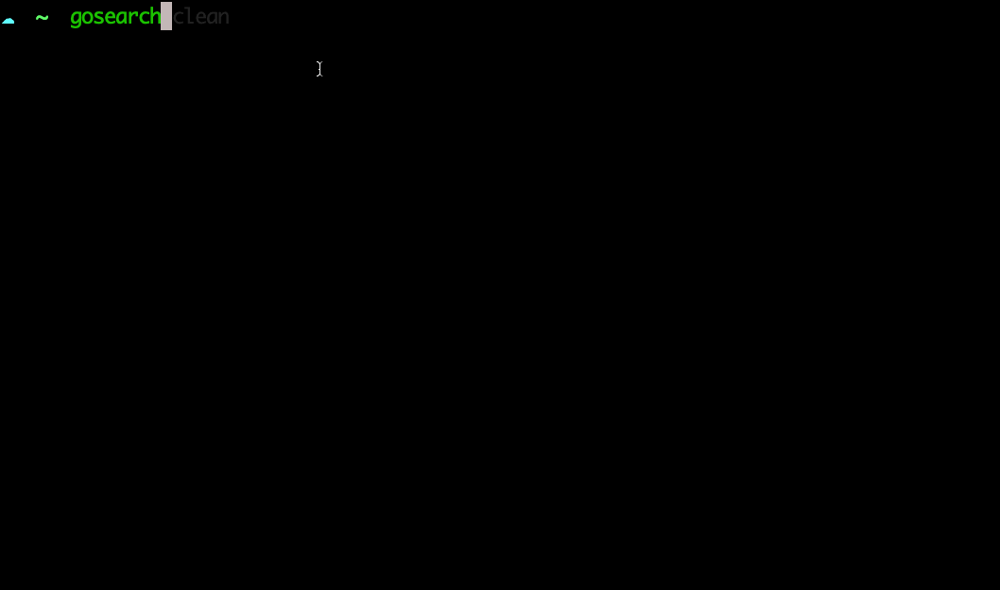

### gosearch
search pop golang packages then install it, you can provide a part of package name or full package name



### Install

* install by go
```
go get github.com/clearcodecn/gosearch
```

* download from release to click [here](https://github.com/clearcodecn/gosearch/releases)


### Search a package via keyword
- noteSearch package with full package will run `go get packageName` directly
```
☁  ~  gosearch logrus gin websocket
? select a package logrus	github.com/sirupsen/logrus	Package logrus is a structured logger for Go, completely API compatible with the standard library logger.
😛  go get github.com/sirupsen/logrus
go: github.com/sirupsen/logrus upgrade => v1.6.0
💯  done
? select a package gin	github.com/gin-gonic/gin	Package gin implements a HTTP web framework called gin.
😛  go get github.com/gin-gonic/gin
go: github.com/gin-gonic/gin upgrade => v1.6.3
💯  done
? select a package websocket	github.com/gorilla/websocket	Package websocket implements the WebSocket protocol defined in RFC 6455.
😛  go get github.com/gorilla/websocket
go: github.com/gorilla/websocket upgrade => v1.4.2
💯  done
☁  ~
``` 

### Clean cache
```
☁  ~  gosearch clean
😜  clean success
```